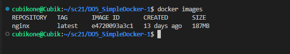
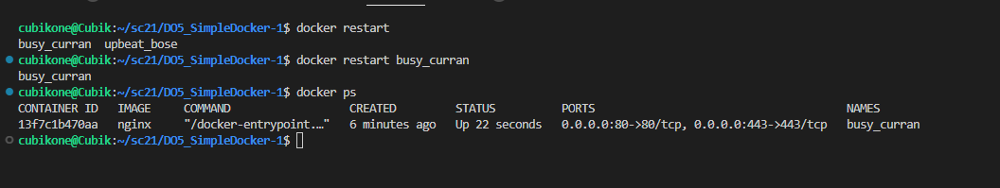
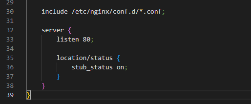
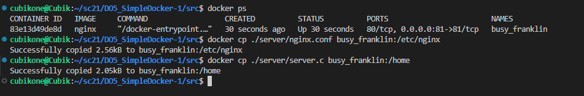
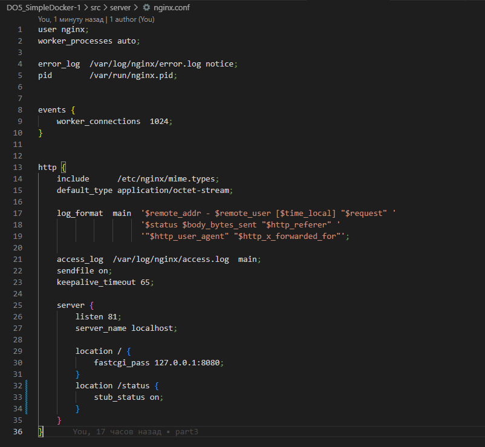

## Part 1. Готовый докер

1) Проверил наличие докер-образа через docker images.  
  

2) Запустил докер-образ через docker run -d nginx.  
  

3) Проверил, что образ запустился через docker ps  

4) Посмотрел информацию о контейнере через docker inspect upbeat_bose 

    - Размер контейнера: составляет 19 байт  
      

    - Cписок замапленных портов: контейнер прослушивает порт 80 по протоколу TCP  
      

    - ip контейнера: 172.17.0.2  
      

5) Остановил докер образ через docker stop upbeat_bose
    - 

6) Запустил докер с портами 80 и 443 в контейнере, замапленными на такие же порты на локальной машине, через команду docker run -d -p 80:80 -p 443:443 nginx, так же перейдя по адресу localhost:80 увидим стартовую страницу.
    - 
    - 

7) Перезапустил докер контейнер через docker restart busy_curran, и проверил docker ps что контейнер запустился
    - 

## Part 2. Операции с контейнером

1) Прочитали конфиг файла nginx.conf с помощью docker exec busy_curran cat /etc/nginx/nginx.conf

2) Создал на локальной машине файл nginx.conf. Настроил в нем по пути /status отдачу страницы статуса сервера nginx.  

3) Скопировал созданный файл nginx.conf внутрь докер-образа через команду docker cp nginx.conf busy_curran:/etc/nginx

4) Перезапустил nginx внутри докер-образа через команду docker exec busy_curran nginx -s reload  

5) Проверил, что по адресу localhost:80/status отдается страничка со статусом сервера nginx.  

6) Экспортировал контейнер в файл container.tar через команду docker export busy_curran > container.tar. Остановил контейнер docker stop busy_curran  

7) Удалил образ через docker rmi -f nginx, не удаляя перед этим контейнеры. Удалил остановленный контейнер docker rm busy_curran.  

8) Импортировал контейнер обратно через команду import сontainer.tar. Запусти импортированный контейнер docker run -d -p 80:80 -p 443:443 fc9ebfd8ab8a nginx -g 'daemon off;'  
  

9) Проверим, что по адресу localhost:80/status отдается страничка со статусом сервера nginx.  

## Part 3. Мини веб-сервер

1) Напишим мини-сервер на C и FastCgi, который будет возвращать простейшую страничку с надписью Hello World!.  
  
  

2) Cкопируем наши файлы с локальной машины в образ докера.  
 

3) Переходим внутрь контейнера 83e13d49de8d, и устанавливаем там нужные утилиты(gcc, spawn-fcgi, libfcgi-dev)

4) Компилируем файл gcc server.c -lfcgi -o serverr и запускаем мини-сервер на порту 8080 spawn-fcgi -p 8080 ./server  

5) Проверяем что в браузере по http://localhost:81/ открывается написанная страничка  

## Part 4. Свой докер

1) Напишем Dockerfile, который будет собирать образ, server.c и nginx.conf берем из part3, по сути в DockerFile у нас происходит, тоже что мы делали "руками" из части 3  

2) Напишем bash-скрипт, который будет компилировать файл, и запускать его на порту 8080. И запускаем nginx.  

3) Соберем свой образ командной, указав тег(last) и имя(cubik_one) docker build -t cubik_one:last .  Проверим через docker images, что всё собралось корректно.

4) Запустил собранный докер-образ с маппингом 81 порта на 80 на локальной машине и маппингом папки ./nginx внутрь контейнера по адресу, где лежат конфигурационные файлы nginx'а docker run -it -p 80:81 -v /home/cubikone/sc21/DO5_SimpleDocker-1/src/server/nginx.conf:/etc/nginx/nginx.conf -d cubik_one:last bash  

5) Проверим, что по localhost:80 доступна страничка написанного мини сервера.  

6) Изменим конфиг, что бы http://localhost/status выдавал статус сервера  
  

## Part 5. Dockle

1) Используем утилиту dockle для проверки образа   

2) Изменим докерфайл что бы убрать ошибки и предупреждения  
 

3) Создадим новый образ с тегом fix  

4) Проверим что ошибок и предупреждений нет.  

## Part 6. Базовый Docker Compose

1) Напишем докер-компос который будет поднимать докер-контейнер из части5 и поднимать докер-контейнер с nginx  
  

2) Изменим Dockerfile  
  

3) Поменяем nginx конфиг  
  

4) Соберём и запустим docker-compose  
  

5) Проверим что по адресу http://localhost/ выдается страничка Hello World!  
   